# AgroServ — Fluxogramas

Oito diagramas que explicam a navegação, a autenticação e a arquitetura do AgroServ. Cada um aparece como imagem; o código-fonte em [Mermaid](https://mermaid.js.org/) fica logo abaixo, em "Ver código Mermaid".

1. [Mapa de navegação](#1-mapa-de-navegação)
2. [Proteção de rotas (ProtectedRoute)](#2-proteção-de-rotas-protectedroute)
3. [Fluxo de login](#3-fluxo-de-login)
4. [Restauração da sessão ao abrir o app](#4-restauração-da-sessão-ao-abrir-o-app)
5. [Arquitetura em camadas](#5-arquitetura-em-camadas)
6. [Caminho de uma requisição de dados](#6-caminho-de-uma-requisição-de-dados)
7. [Busca e filtros de serviços](#7-busca-e-filtros-de-serviços)
8. [Estados de interface de uma listagem](#8-estados-de-interface-de-uma-listagem)

---

## 1. Mapa de navegação

Páginas públicas em verde-claro, área privada em verde-escuro.

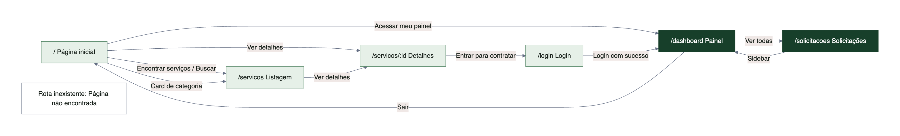

Ver código Mermaid

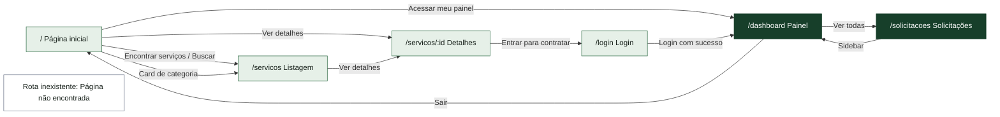

## 2. Proteção de rotas (ProtectedRoute)

Implementado em `src/routes/ProtectedRoute.tsx`. Envolve todas as rotas privadas.

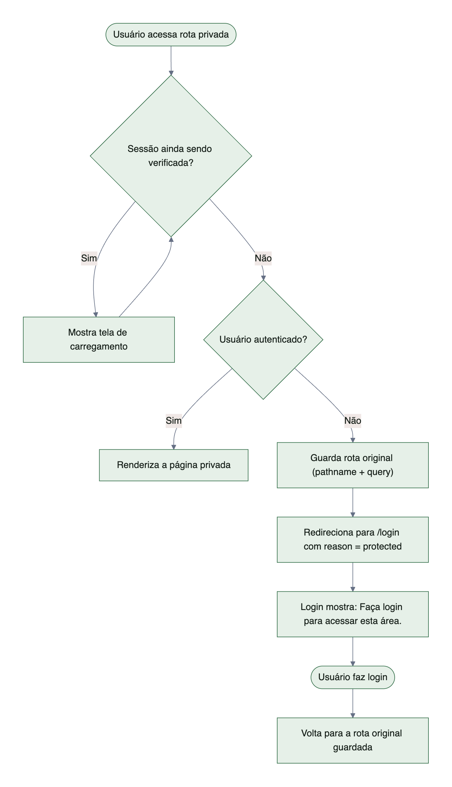

Ver código Mermaid

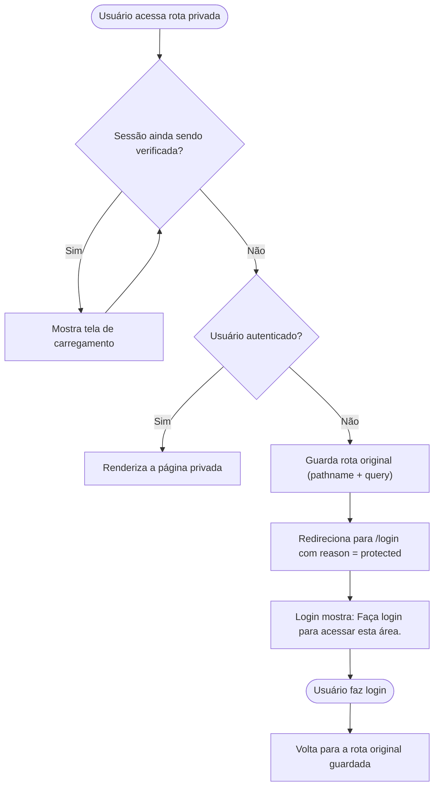

## 3. Fluxo de login

Implementado em `src/pages/LoginPage.tsx` e `src/contexts/AuthProvider.tsx`.

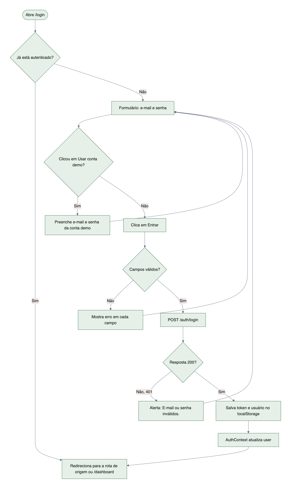

Ver código Mermaid

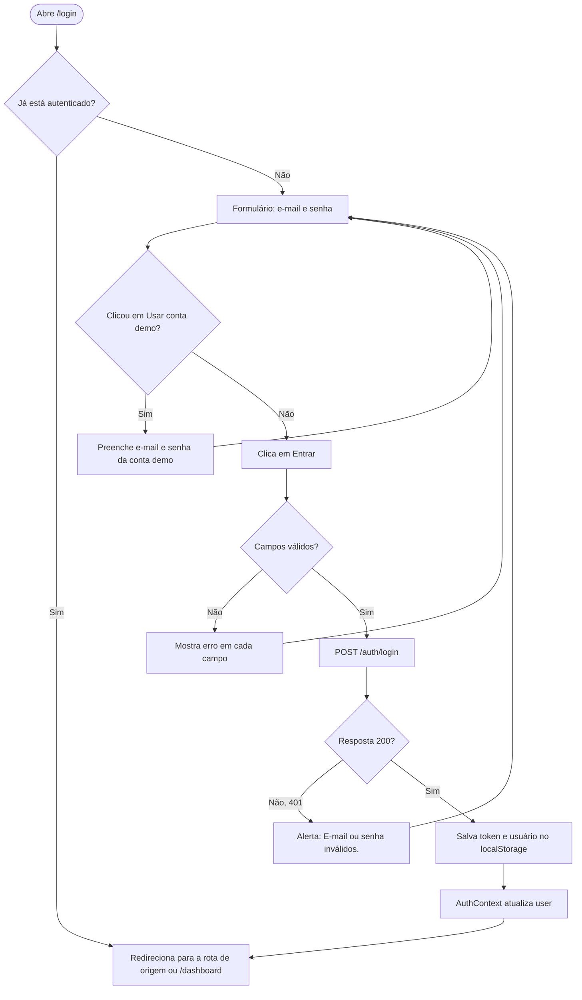

## 4. Restauração da sessão ao abrir o app

Implementado em `src/contexts/AuthProvider.tsx`.

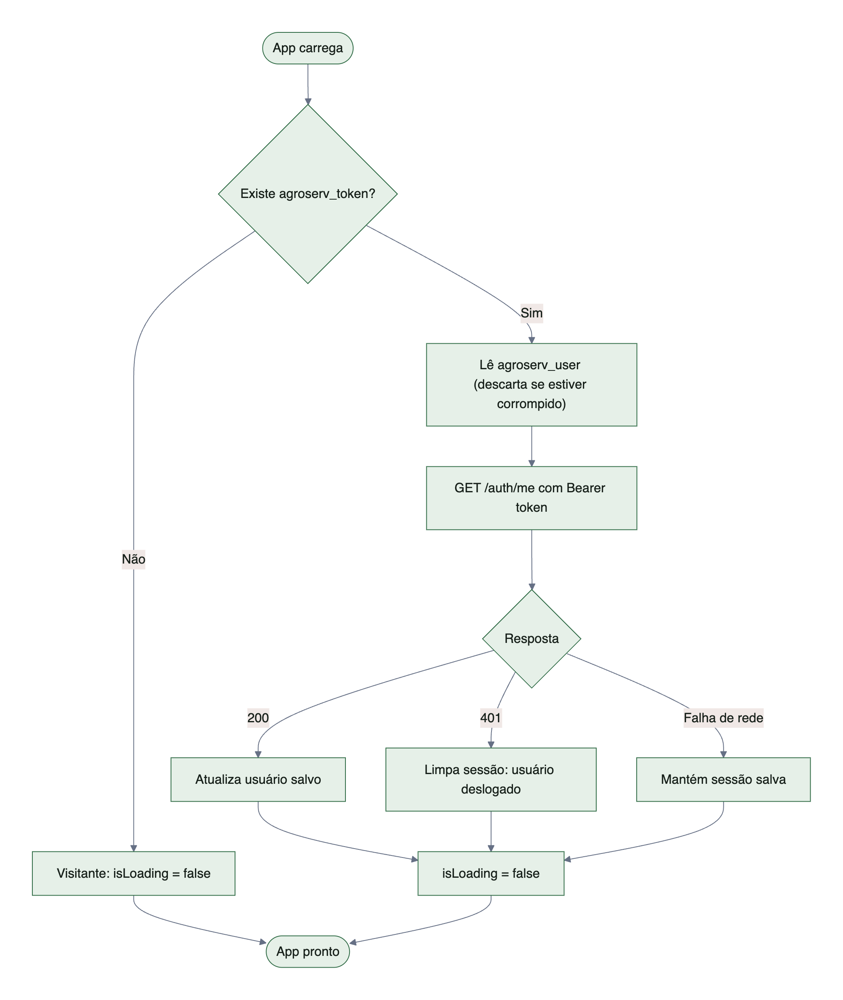

Ver código Mermaid

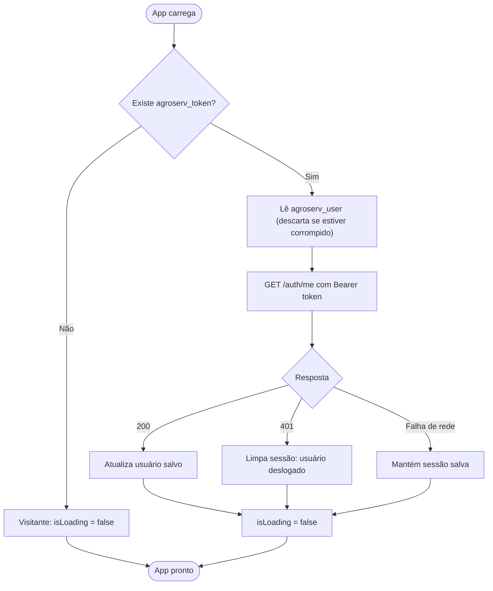

## 5. Arquitetura em camadas

A interface nunca acessa os dados diretamente. Trocar dados simulados por API real é uma variável de ambiente.

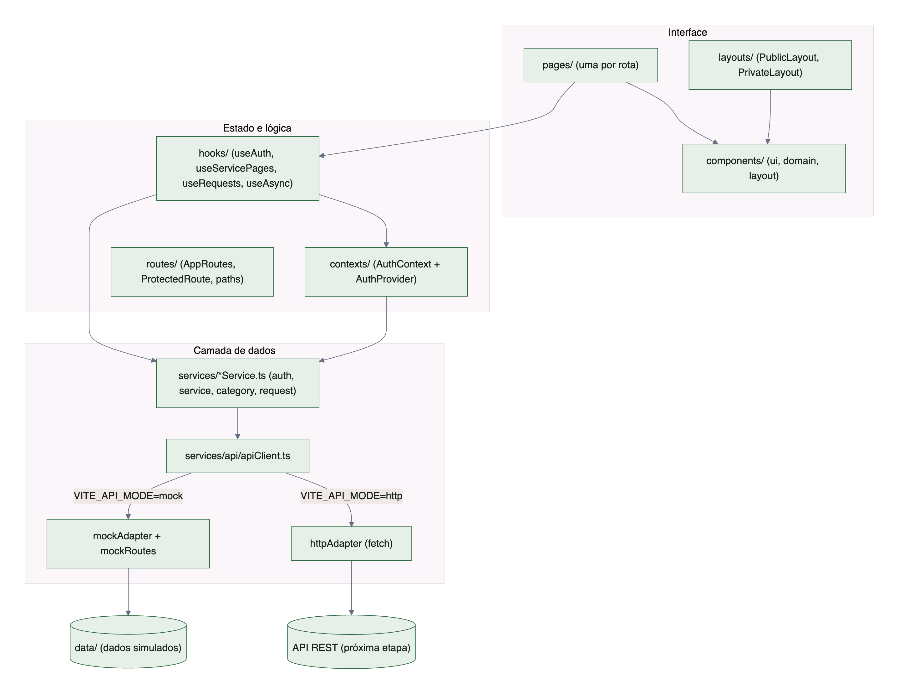

Ver código Mermaid

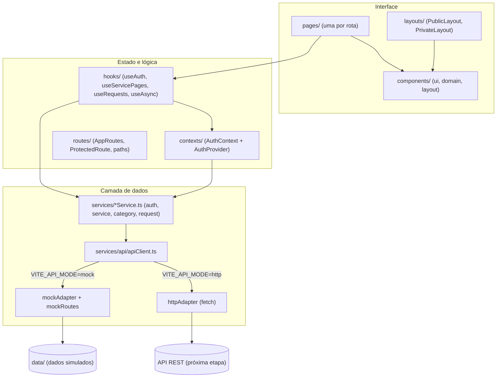

## 6. Caminho de uma requisição de dados

Exemplo: abrir a listagem de serviços.

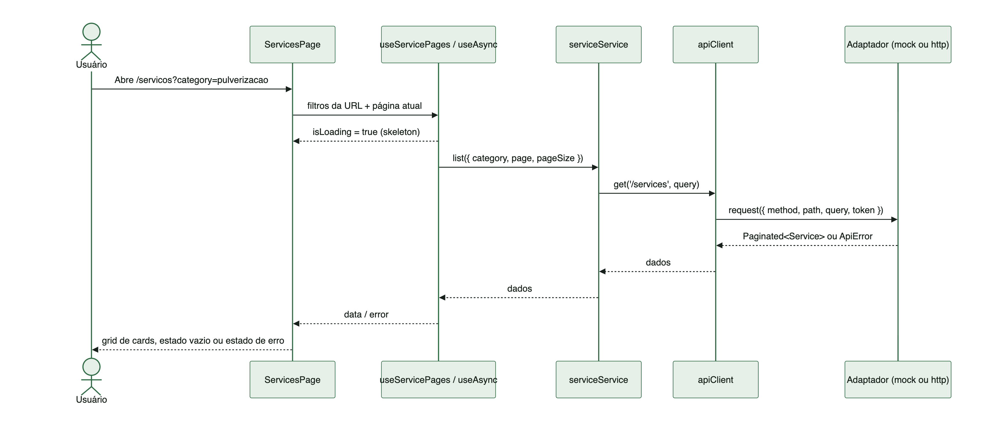

Ver código Mermaid

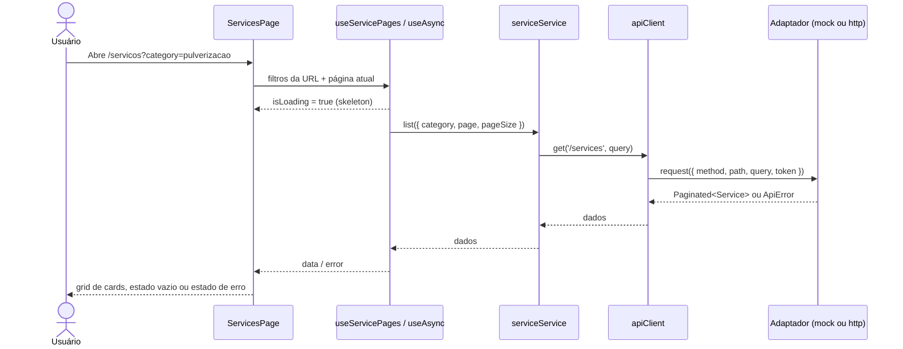

## 7. Busca e filtros de serviços

Implementado em `src/pages/ServicesPage.tsx` (estado na URL) e `src/services/api/mockRoutes.ts` (regras do "servidor").

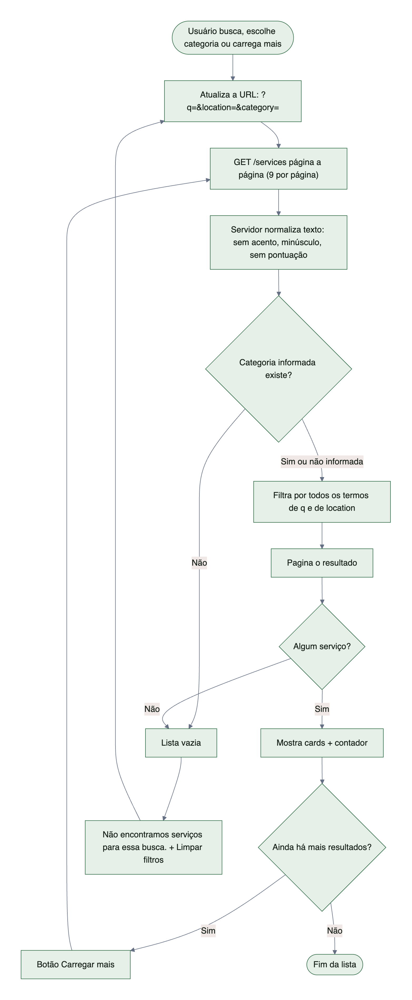

Ver código Mermaid

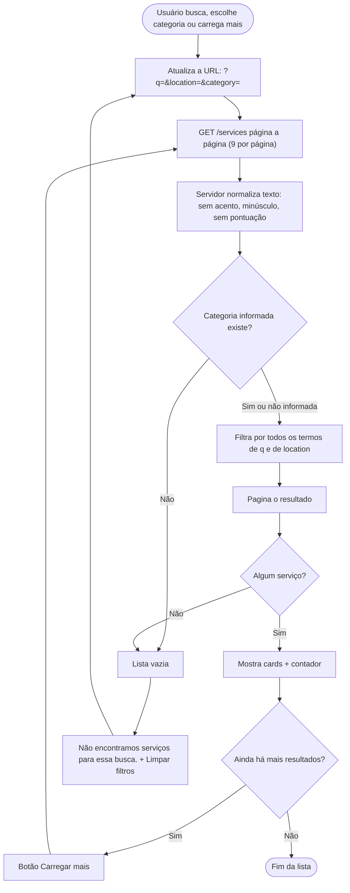

## 8. Estados de interface de uma listagem

Padrão aplicado em todas as páginas com dados (home, serviços, detalhe, dashboard, solicitações).

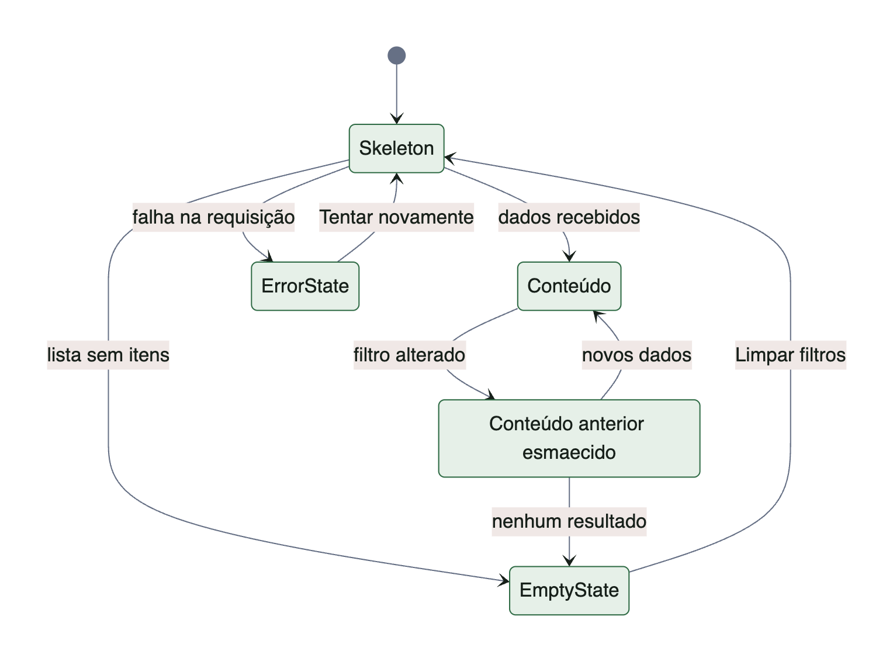

Ver código Mermaid

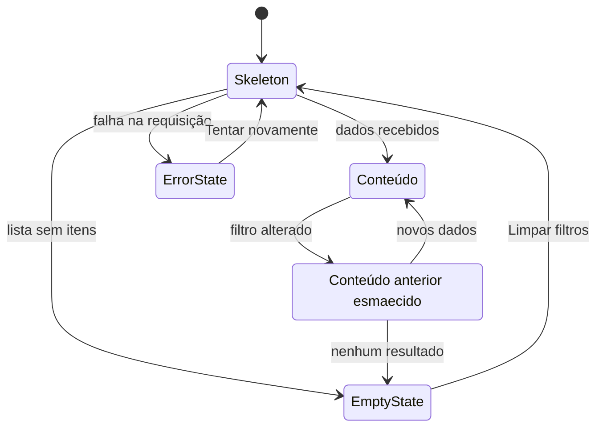

