# AgroServ — Fluxogramas

Dez diagramas que explicam a navegação, a autenticação, a arquitetura do front-end e do back-end e as regras principais do AgroServ. Cada um aparece como imagem; o código-fonte em [Mermaid](https://mermaid.js.org/) fica logo abaixo, em "Ver código Mermaid".

Veja também o [fluxograma único do sistema](system-flowchart.md).

1. [Mapa de navegação](#1-mapa-de-navegação)
2. [Proteção de rotas (ProtectedRoute)](#2-proteção-de-rotas-protectedroute)
3. [Fluxo de login](#3-fluxo-de-login)
4. [Restauração da sessão ao abrir o app](#4-restauração-da-sessão-ao-abrir-o-app)
5. [Arquitetura em camadas](#5-arquitetura-em-camadas)
6. [Caminho de uma requisição de dados](#6-caminho-de-uma-requisição-de-dados)
7. [Busca, filtros e mapa de serviços](#7-busca-filtros-e-mapa-de-serviços)
8. [Estados de interface de uma listagem](#8-estados-de-interface-de-uma-listagem)
9. [Ciclo de vida da solicitação](#9-ciclo-de-vida-da-solicitação)
10. [Uma requisição dentro do back-end](#10-uma-requisição-dentro-do-back-end)

---

## 1. Mapa de navegação

Páginas públicas em verde-claro, área do produtor em verde-escuro, área do prestador em azul e área do administrador em cinza.

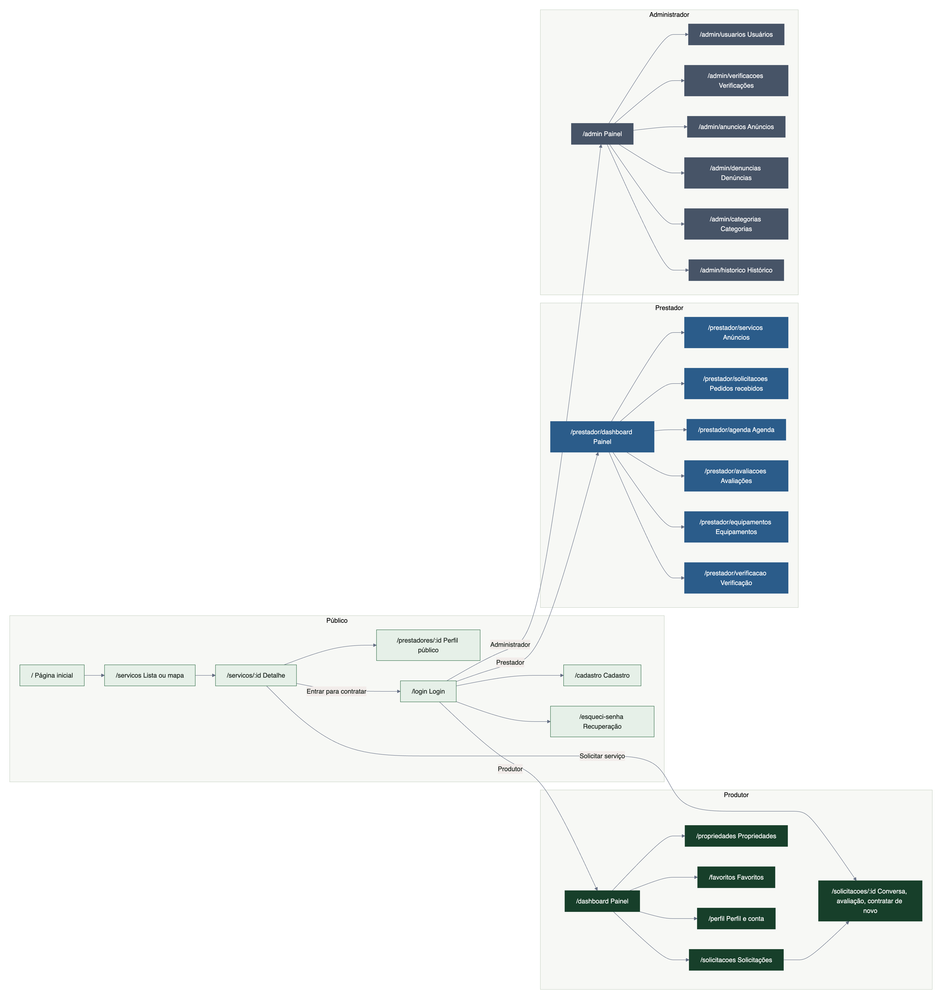

Ver código Mermaid

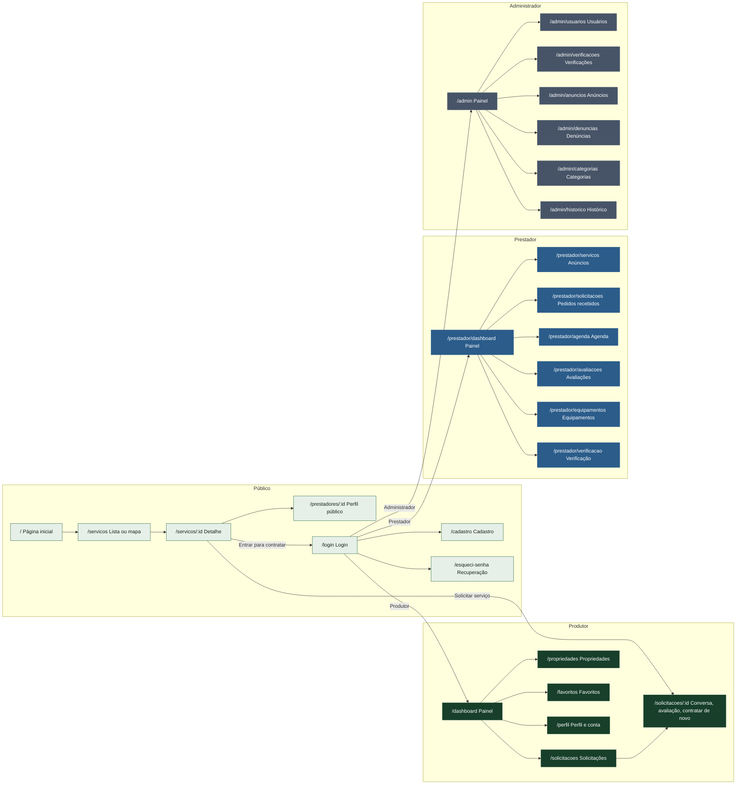
```mermaid
flowchart LR
    subgraph PUBLIC["Público"]
        home["/ Página inicial"]
        services["/servicos Lista ou mapa"]
        detail["/servicos/:id Detalhe"]
        provider["/prestadores/:id Perfil público"]
        login["/login Login"]
        register["/cadastro Cadastro"]
        forgot["/esqueci-senha Recuperação"]
    end

    subgraph PRODUCER["Produtor"]
        pDash["/dashboard Painel"]
        pReq["/solicitacoes Solicitações"]
        pReqDetail["/solicitacoes/:id Conversa, avaliação, contratar de novo"]
        pProps["/propriedades Propriedades"]
        pFav["/favoritos Favoritos"]
        pProfile["/perfil Perfil e conta"]
    end

    subgraph PROVIDER["Prestador"]
        vDash["/prestador/dashboard Painel"]
        vServices["/prestador/servicos Anúncios"]
        vReq["/prestador/solicitacoes Pedidos recebidos"]
        vAgenda["/prestador/agenda Agenda"]
        vReviews["/prestador/avaliacoes Avaliações"]
        vEquip["/prestador/equipamentos Equipamentos"]
        vVerify["/prestador/verificacao Verificação"]
    end

    subgraph ADMIN["Administrador"]
        aDash["/admin Painel"]
        aUsers["/admin/usuarios Usuários"]
        aVerify["/admin/verificacoes Verificações"]
        aAds["/admin/anuncios Anúncios"]
        aReports["/admin/denuncias Denúncias"]
        aCats["/admin/categorias Categorias"]
        aLog["/admin/historico Histórico"]
    end

    home --> services
    services --> detail
    detail --> provider
    detail -->|Entrar para contratar| login
    login --> register
    login --> forgot
    login -->|Produtor| pDash
    login -->|Prestador| vDash
    login -->|Administrador| aDash
    detail -->|Solicitar serviço| pReqDetail
    pDash --> pReq --> pReqDetail
    pDash --> pProps
    pDash --> pFav
    pDash --> pProfile
    vDash --> vServices
    vDash --> vReq
    vDash --> vAgenda
    vDash --> vReviews
    vDash --> vEquip
    vDash --> vVerify
    aDash --> aUsers
    aDash --> aVerify
    aDash --> aAds
    aDash --> aReports
    aDash --> aCats
    aDash --> aLog

    classDef public fill:#E6F0E8,stroke:#2F6B45,color:#17201A
    classDef producer fill:#173F2A,stroke:#173F2A,color:#FFFFFF
    classDef provider fill:#2B5C8A,stroke:#2B5C8A,color:#FFFFFF
    classDef admin fill:#475467,stroke:#475467,color:#FFFFFF
    class home,services,detail,provider,login,register,forgot public
    class pDash,pReq,pReqDetail,pProps,pFav,pProfile producer
    class vDash,vServices,vReq,vAgenda,vReviews,vEquip,vVerify provider
    class aDash,aUsers,aVerify,aAds,aReports,aCats,aLog admin
```

## 2. Proteção de rotas (ProtectedRoute)

Implementado em `frontend/src/routes/ProtectedRoute.tsx`. Cada área privada declara os papéis aceitos.

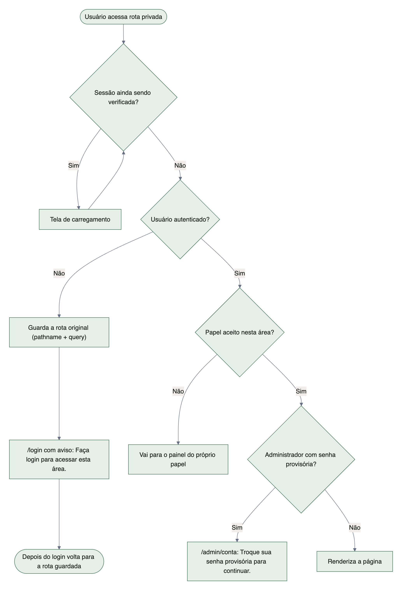

Ver código Mermaid

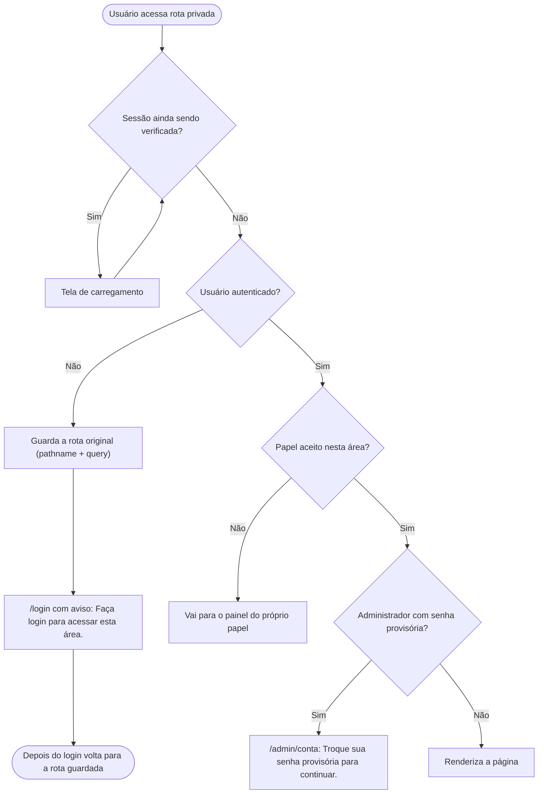
```mermaid
flowchart TD
    start([Usuário acessa rota privada]) --> loading{Sessão ainda sendo verificada?}
    loading -->|Sim| loader[Tela de carregamento]
    loader --> loading
    loading -->|Não| auth{Usuário autenticado?}
    auth -->|Não| save["Guarda a rota original (pathname + query)"]
    save --> redirect["/login com aviso: Faça login para acessar esta área."]
    redirect --> back([Depois do login volta para a rota guardada])
    auth -->|Sim| role{Papel aceito nesta área?}
    role -->|Não| home["Vai para o painel do próprio papel"]
    role -->|Sim| temp{Administrador com senha provisória?}
    temp -->|Sim| account["/admin/conta: Troque sua senha provisória para continuar."]
    temp -->|Não| allow[Renderiza a página]
```

## 3. Fluxo de login

Implementado em `frontend/src/pages/LoginPage.tsx` e `frontend/src/contexts/AuthProvider.tsx`.

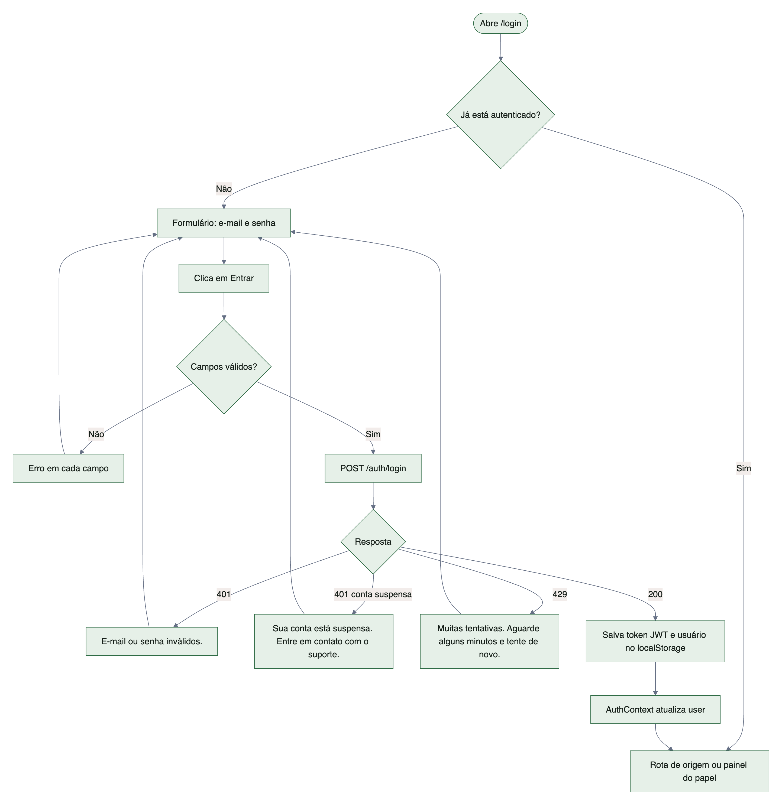

Ver código Mermaid

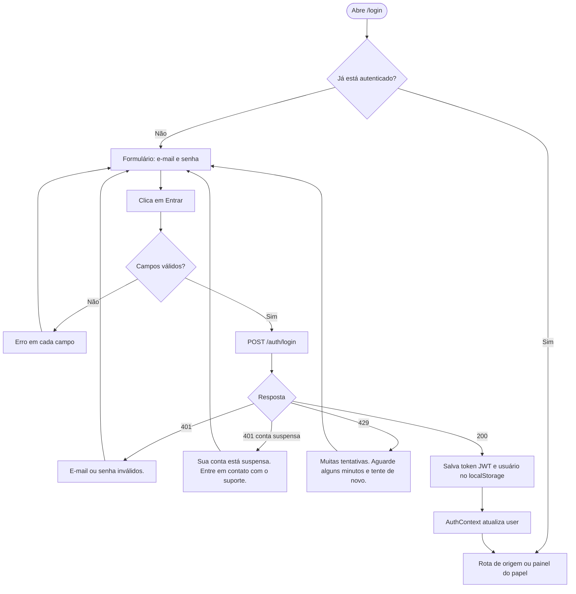
```mermaid
flowchart TD
    open([Abre /login]) --> already{Já está autenticado?}
    already -->|Sim| goFrom[Rota de origem ou painel do papel]
    already -->|Não| form[Formulário: e-mail e senha]
    form --> submit[Clica em Entrar]
    submit --> validate{Campos válidos?}
    validate -->|Não| fieldErrors[Erro em cada campo]
    fieldErrors --> form
    validate -->|Sim| api["POST /auth/login"]
    api --> ok{Resposta}
    ok -->|401| apiError["E-mail ou senha inválidos."]
    ok -->|401 conta suspensa| suspended["Sua conta está suspensa. Entre em contato com o suporte."]
    ok -->|429| limit["Muitas tentativas. Aguarde alguns minutos e tente de novo."]
    apiError --> form
    suspended --> form
    limit --> form
    ok -->|200| persist["Salva token JWT e usuário no localStorage"]
    persist --> state[AuthContext atualiza user]
    state --> goFrom
```

## 4. Restauração da sessão ao abrir o app

Implementado em `frontend/src/contexts/AuthProvider.tsx`.

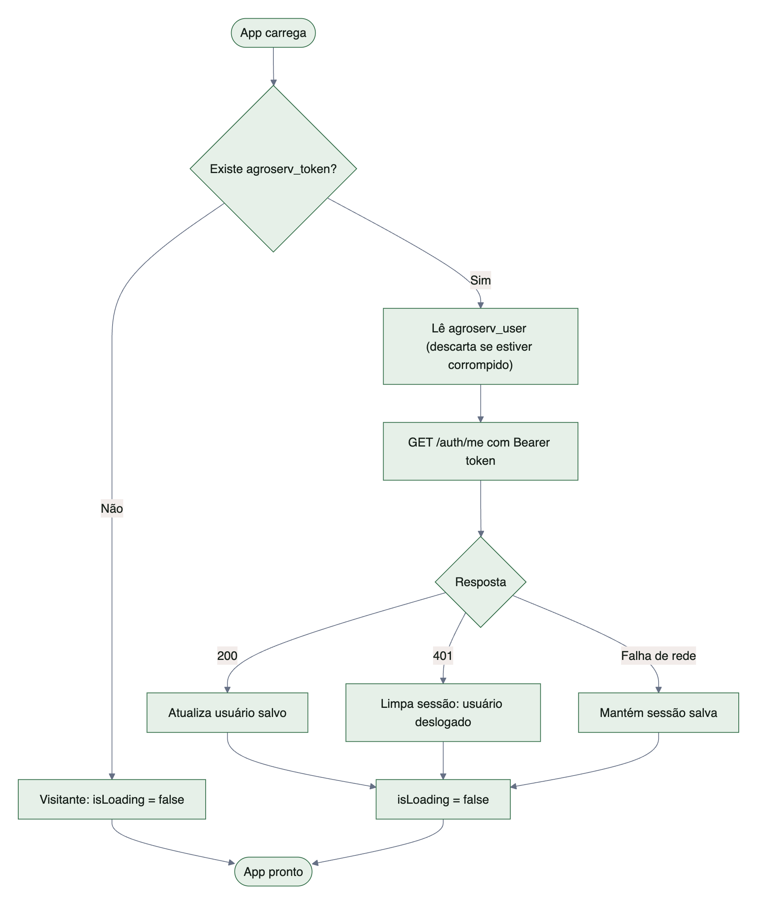

Ver código Mermaid

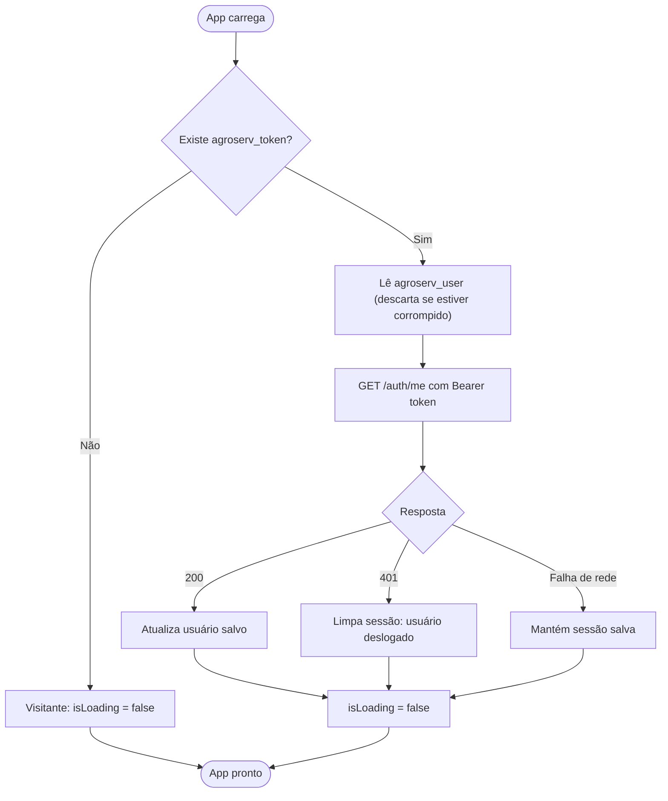
```mermaid
flowchart TD
    boot([App carrega]) --> token{Existe agroserv_token?}
    token -->|Não| guest[Visitante: isLoading = false]
    token -->|Sim| stored["Lê agroserv_user (descarta se estiver corrompido)"]
    stored --> me["GET /auth/me com Bearer token"]
    me --> result{Resposta}
    result -->|200| refresh[Atualiza usuário salvo]
    result -->|401| clear[Limpa sessão: usuário deslogado]
    result -->|Falha de rede| keep[Mantém sessão salva]
    refresh --> done[isLoading = false]
    clear --> done
    keep --> done
    guest --> ready([App pronto])
    done --> ready
```

## 5. Arquitetura em camadas

A interface nunca acessa os dados diretamente. Trocar o mock pela API real é uma variável de ambiente (`VITE_API_MODE`).

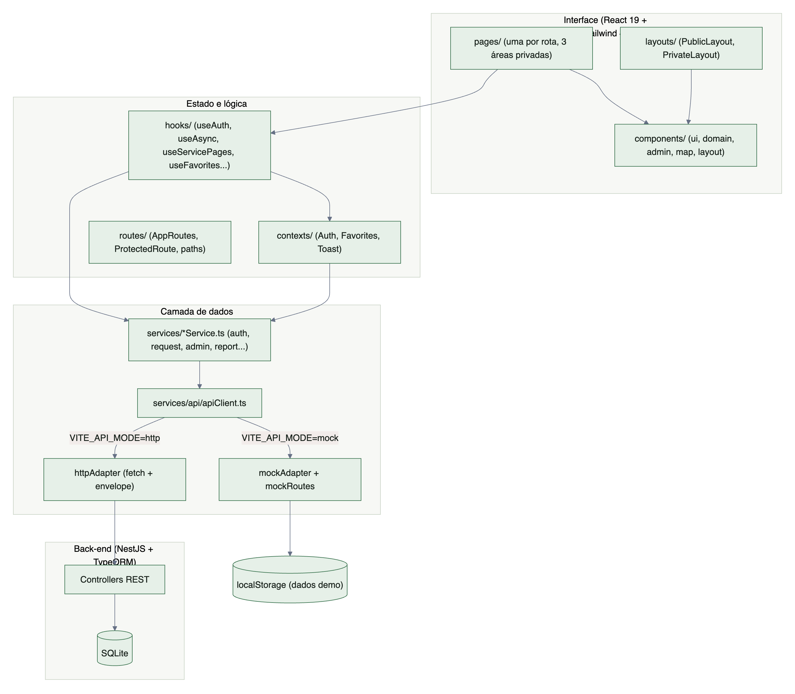

Ver código Mermaid

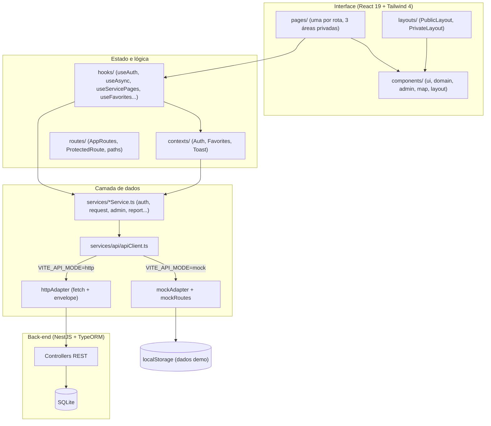
```mermaid
flowchart TB
    subgraph UI["Interface (React 19 + Tailwind 4)"]
        pages["pages/ (uma por rota, 3 áreas privadas)"]
        components["components/ (ui, domain, admin, map, layout)"]
        layouts["layouts/ (PublicLayout, PrivateLayout)"]
    end
    subgraph State["Estado e lógica"]
        hooks["hooks/ (useAuth, useAsync, useServicePages, useFavorites...)"]
        contexts["contexts/ (Auth, Favorites, Toast)"]
        routes["routes/ (AppRoutes, ProtectedRoute, paths)"]
    end
    subgraph Data["Camada de dados"]
        services["services/*Service.ts (auth, request, admin, report...)"]
        client["services/api/apiClient.ts"]
        mock["mockAdapter + mockRoutes"]
        http["httpAdapter (fetch + envelope)"]
    end
    seeds[("localStorage (dados demo)")]
    subgraph Backend["Back-end (NestJS + TypeORM)"]
        api["Controllers REST"]
        db[("SQLite")]
    end

    pages --> components
    layouts --> components
    pages --> hooks
    hooks --> contexts
    hooks --> services
    contexts --> services
    services --> client
    client -->|VITE_API_MODE=mock| mock
    client -->|VITE_API_MODE=http| http
    mock --> seeds
    http --> api
    api --> db
```

## 6. Caminho de uma requisição de dados

Exemplo: abrir a listagem de serviços. O caminho é o mesmo nos dois modos; só o adaptador muda.

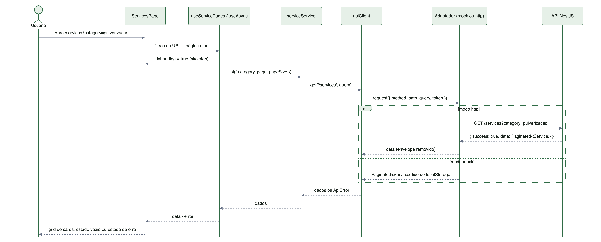

Ver código Mermaid

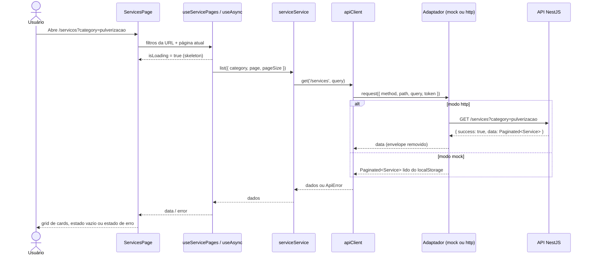
```mermaid
sequenceDiagram
    actor U as Usuário
    participant P as ServicesPage
    participant H as useServicePages / useAsync
    participant S as serviceService
    participant C as apiClient
    participant A as Adaptador (mock ou http)
    participant B as API NestJS

    U->>P: Abre /servicos?category=pulverizacao
    P->>H: filtros da URL + página atual
    H-->>P: isLoading = true (skeleton)
    H->>S: list({ category, page, pageSize })
    S->>C: get('/services', query)
    C->>A: request({ method, path, query, token })
    alt modo http
        A->>B: GET /services?category=pulverizacao
        B-->>A: { success: true, data: Paginated<Service> }
        A-->>C: data (envelope removido)
    else modo mock
        A-->>C: Paginated<Service> lido do localStorage
    end
    C-->>S: dados ou ApiError
    S-->>H: dados
    H-->>P: data / error
    P-->>U: grid de cards, estado vazio ou estado de erro
```

## 7. Busca, filtros e mapa de serviços

Implementado em `frontend/src/pages/ServicesPage.tsx` (estado na URL), `frontend/src/components/domain/ServicesMapPanel.tsx` e no endpoint `GET /services`.

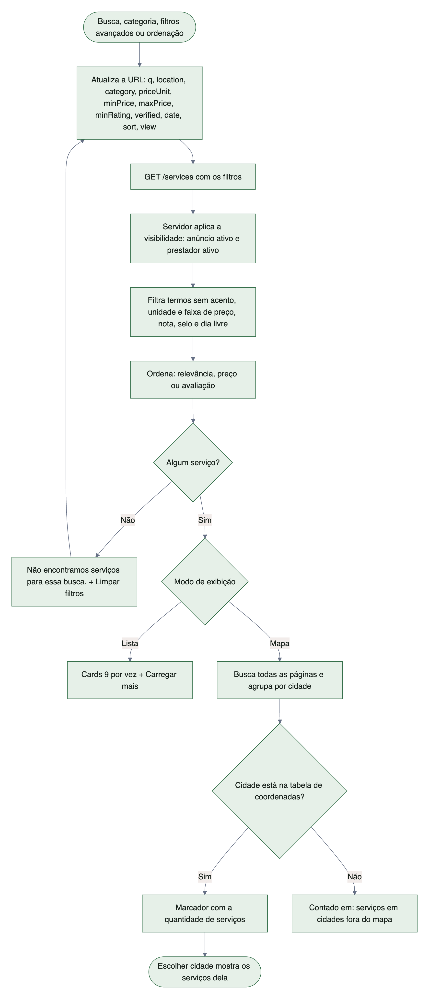

Ver código Mermaid

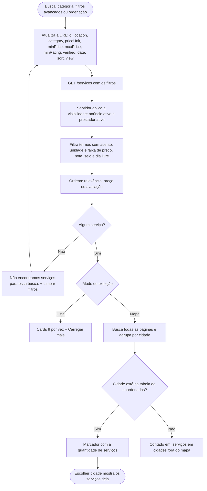
```mermaid
flowchart TD
    input([Busca, categoria, filtros avançados ou ordenação]) --> url["Atualiza a URL: q, location, category, priceUnit, minPrice, maxPrice, minRating, verified, date, sort, view"]
    url --> request["GET /services com os filtros"]
    request --> visible["Servidor aplica a visibilidade: anúncio ativo e prestador ativo"]
    visible --> filter["Filtra termos sem acento, unidade e faixa de preço, nota, selo e dia livre"]
    filter --> sort["Ordena: relevância, preço ou avaliação"]
    sort --> any{Algum serviço?}
    any -->|Não| empty["Não encontramos serviços para essa busca. + Limpar filtros"]
    empty --> url
    any -->|Sim| view{Modo de exibição}
    view -->|Lista| grid["Cards 9 por vez + Carregar mais"]
    view -->|Mapa| map["Busca todas as páginas e agrupa por cidade"]
    map --> table{Cidade está na tabela de coordenadas?}
    table -->|Sim| marker["Marcador com a quantidade de serviços"]
    table -->|Não| off["Contado em: serviços em cidades fora do mapa"]
    marker --> pick([Escolher cidade mostra os serviços dela])
```

## 8. Estados de interface de uma listagem

Padrão aplicado em todas as páginas com dados.

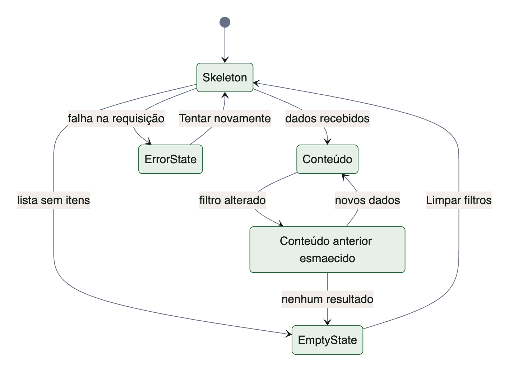

Ver código Mermaid

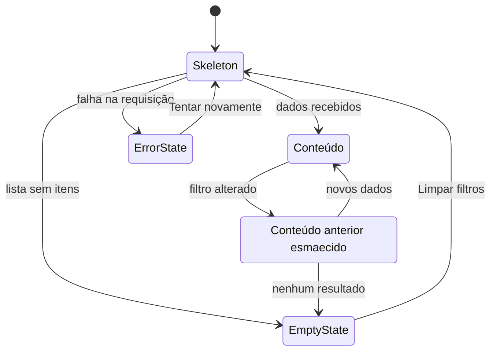
```mermaid
stateDiagram-v2
    [*] --> Carregando
    Carregando --> Sucesso: dados recebidos
    Carregando --> Vazio: lista sem itens
    Carregando --> Erro: falha na requisição
    Erro --> Carregando: Tentar novamente
    Vazio --> Carregando: Limpar filtros
    Sucesso --> Recarregando: filtro alterado
    Recarregando --> Sucesso: novos dados
    Recarregando --> Vazio: nenhum resultado

    Carregando: Skeleton
    Sucesso: Conteúdo
    Vazio: EmptyState
    Erro: ErrorState
    Recarregando: Conteúdo anterior esmaecido
```

## 9. Ciclo de vida da solicitação

As mesmas regras valem no mock e no back-end. Cada transição gera um evento na linha do tempo e uma notificação para a outra parte.

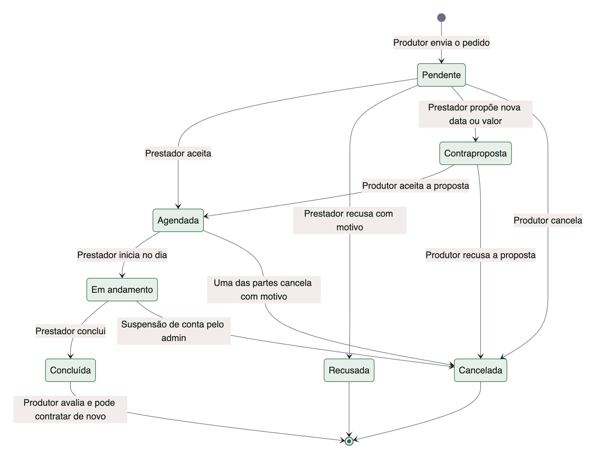

Ver código Mermaid

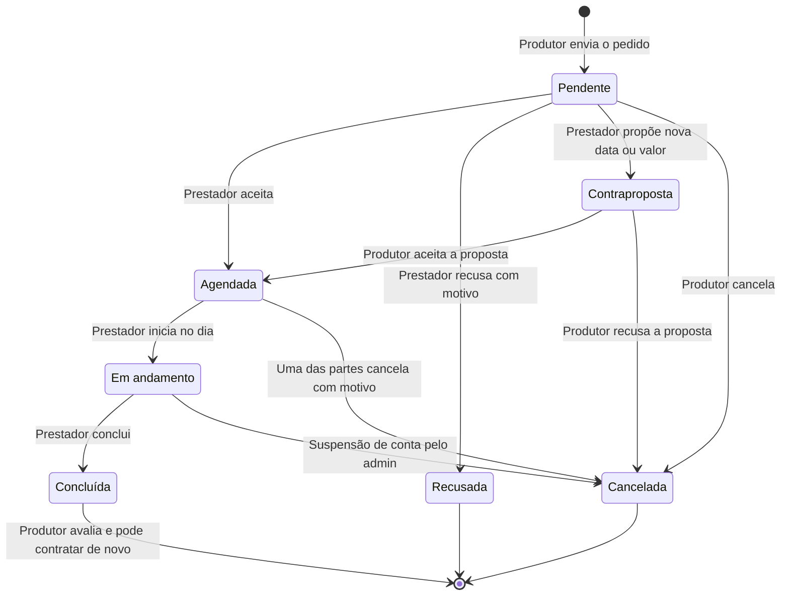
```mermaid
stateDiagram-v2
    [*] --> pending: Produtor envia o pedido
    pending --> accepted: Prestador aceita
    pending --> rejected: Prestador recusa com motivo
    pending --> counter_offer: Prestador propõe nova data ou valor
    pending --> cancelled: Produtor cancela
    counter_offer --> accepted: Produtor aceita a proposta
    counter_offer --> cancelled: Produtor recusa a proposta
    accepted --> in_progress: Prestador inicia no dia
    accepted --> cancelled: Uma das partes cancela com motivo
    in_progress --> completed: Prestador conclui
    in_progress --> cancelled: Suspensão de conta pelo admin
    completed --> [*]: Produtor avalia e pode contratar de novo
    rejected --> [*]
    cancelled --> [*]

    pending: Pendente
    counter_offer: Contraproposta
    accepted: Agendada
    in_progress: Em andamento
    completed: Concluída
    rejected: Recusada
    cancelled: Cancelada
```

## 10. Uma requisição dentro do back-end

Implementado em `backend/src` (NestJS 12, TypeORM e SQLite). Todo endpoint passa pelas mesmas etapas.

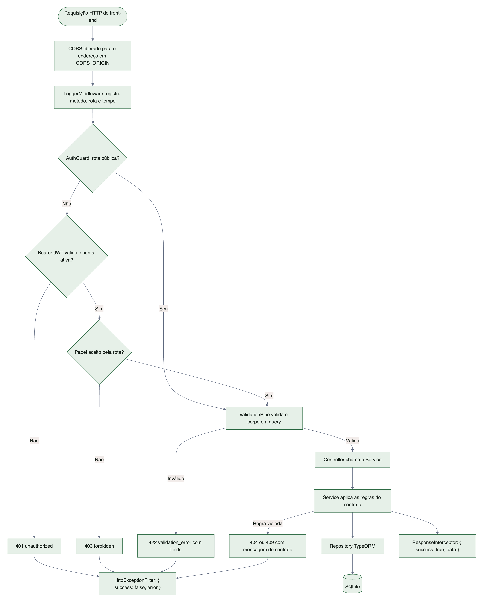

Ver código Mermaid

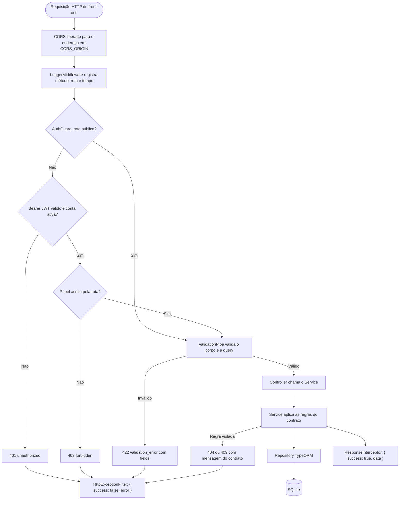
```mermaid
flowchart TD
    req([Requisição HTTP do front-end]) --> cors["CORS liberado para o endereço em CORS_ORIGIN"]
    cors --> log["LoggerMiddleware registra método, rota e tempo"]
    log --> guard{"AuthGuard: rota pública?"}
    guard -->|Não| jwt{"Bearer JWT válido e conta ativa?"}
    jwt -->|Não| e401["401 unauthorized"]
    jwt -->|Sim| roles{"Papel aceito pela rota?"}
    roles -->|Não| e403["403 forbidden"]
    guard -->|Sim| pipe
    roles -->|Sim| pipe["ValidationPipe valida o corpo e a query"]
    pipe -->|Inválido| e422["422 validation_error com fields"]
    pipe -->|Válido| controller["Controller chama o Service"]
    controller --> service["Service aplica as regras do contrato"]
    service --> repo["Repository TypeORM"]
    repo --> sqlite[("SQLite")]
    service -->|Regra violada| e409["404 ou 409 com mensagem do contrato"]
    service --> ok["ResponseInterceptor: { success: true, data }"]
    e401 --> filter["HttpExceptionFilter: { success: false, error }"]
    e403 --> filter
    e422 --> filter
    e409 --> filter
```

