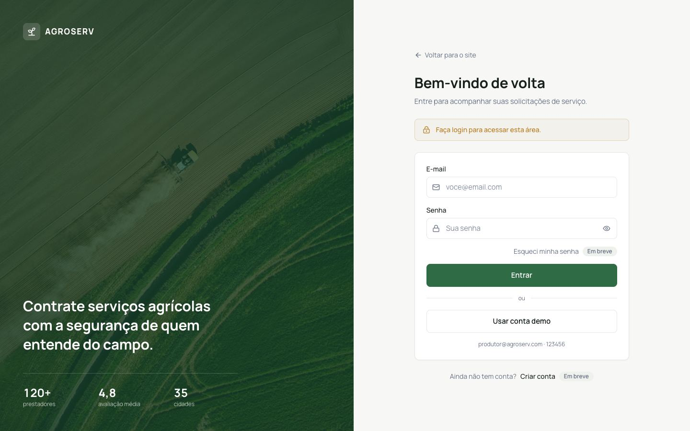
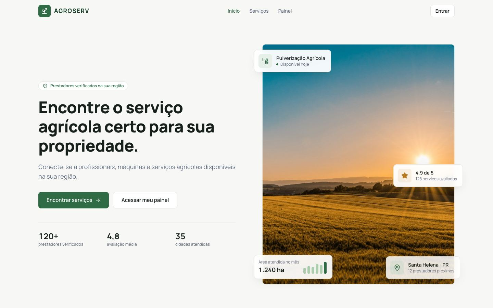
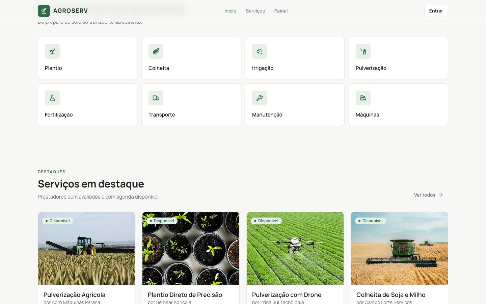
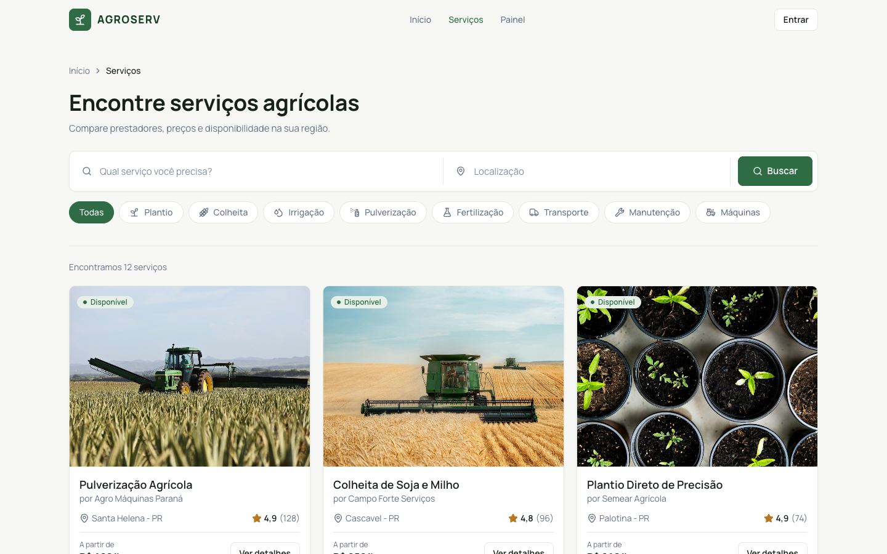
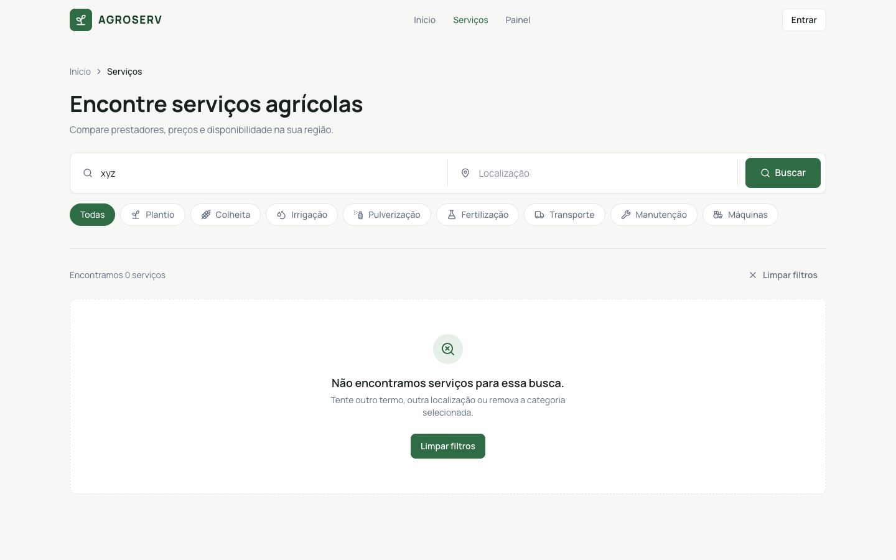
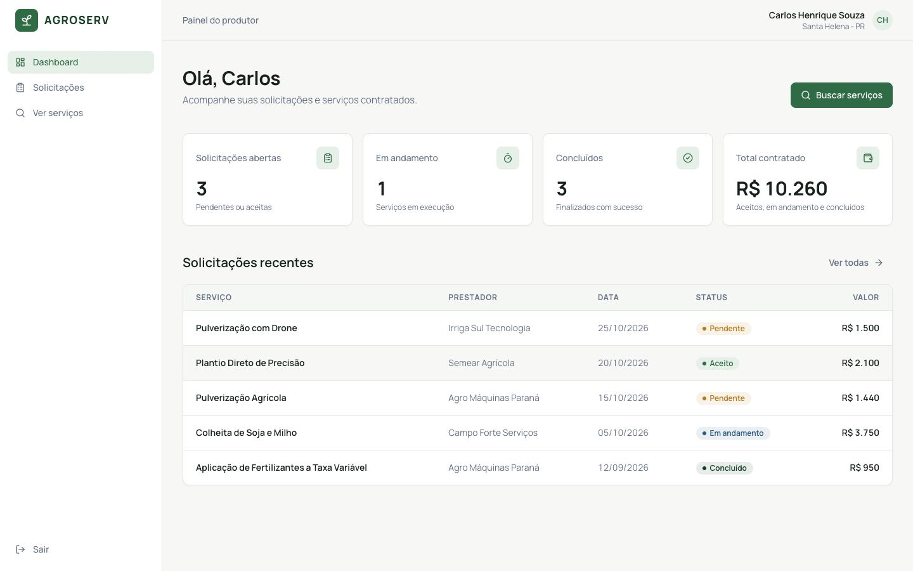
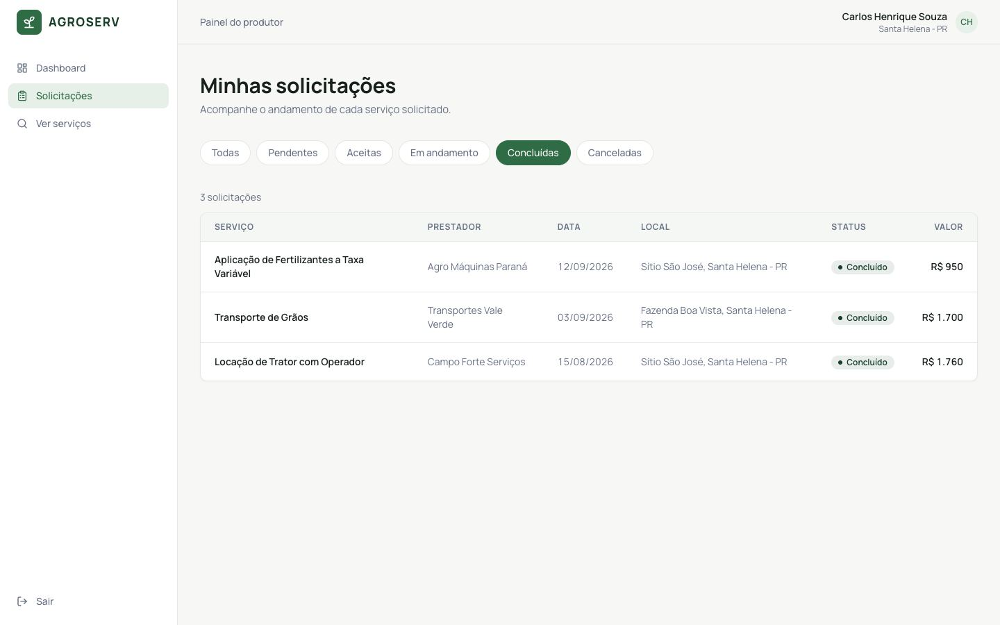
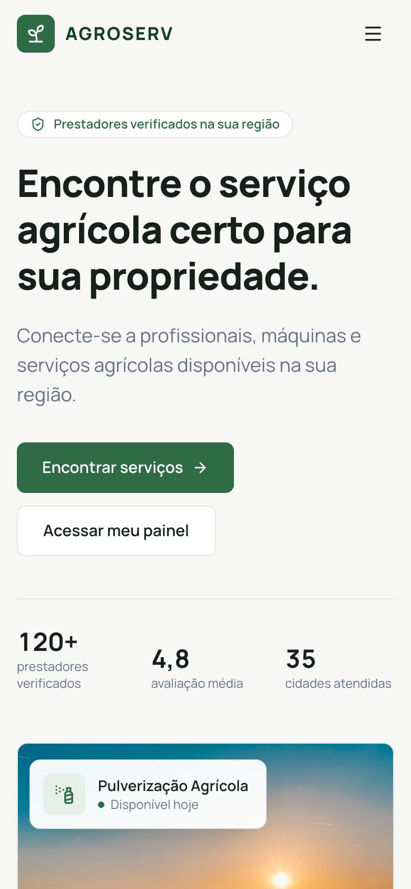
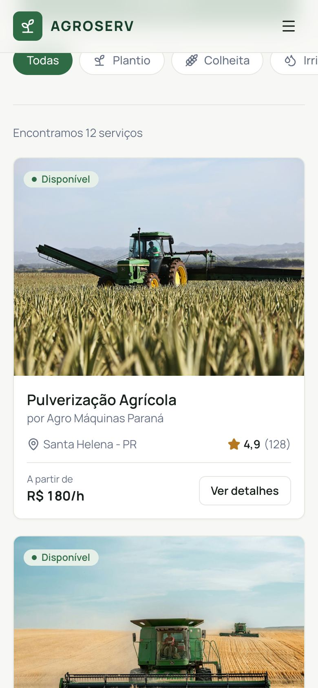

# AgroServ — Relatório técnico

**Projeto:** AgroServ — plataforma de contratação de serviços agrícolas
**Etapa:** 1 — Front-end (o back-end é a próxima etapa da disciplina)
**Data:** outubro de 2026

Documentos complementares:

- Fluxogramas: [`flowcharts.md`](flowcharts.md)
- Apresentação: [`slides/index.html`](slides/index.html) (abrir no navegador; setas para navegar, `F` para tela cheia)
- Contrato da API REST: [`api-contract.md`](api-contract.md)
- Itens adiados: [`backlog.md`](backlog.md)

---

## Sumário

1. [Introdução](#1-introdução)
2. [Requisitos da entrega](#2-requisitos-da-entrega)
3. [Tecnologias](#3-tecnologias)
4. [Arquitetura](#4-arquitetura)
5. [Rotas e navegação](#5-rotas-e-navegação)
6. [Autenticação e proteção de rotas](#6-autenticação-e-proteção-de-rotas)
7. [Páginas](#7-páginas)
8. [Interface, design e animações](#8-interface-design-e-animações)
9. [Preparação para o back-end](#9-preparação-para-o-back-end)
10. [Testes e verificação](#10-testes-e-verificação)
11. [Decisões e limitações](#11-decisões-e-limitações)
12. [Próximas etapas](#12-próximas-etapas)
13. [Como executar](#13-como-executar)

---

## 1. Introdução

A contratação de serviços agrícolas (pulverização, colheita, plantio, transporte, manutenção de máquinas) ainda acontece de forma informal: indicação boca a boca, grupos de mensagem e ligações. O produtor não consegue comparar preço, avaliação e disponibilidade, e não tem um lugar para acompanhar o que contratou.

O **AgroServ** é um marketplace web que conecta **produtores rurais** a **prestadores de serviços agrícolas**. Nesta primeira etapa, o objetivo foi construir o front-end que atende aos requisitos da disciplina, com uma arquitetura que permita ligar o back-end na próxima etapa sem reescrever a interface.

**Objetivos desta etapa**

- Entregar homepage, páginas públicas, área privada, login e proteção de rotas.
- Apresentar visual de produto profissional (referência: SaaS B2B / AgTech).
- Separar interface e dados, consumindo um contrato de API desde o início.
- Garantir qualidade com testes automatizados, tipagem estrita e acessibilidade.

## 2. Requisitos da entrega

| Requisito | Como foi atendido | Onde |
|---|---|---|
| Homepage como ponto de entrada, com navegação clara | Página inicial com cabeçalho fixo, busca, categorias e serviços em destaque; links para todas as áreas | `/` — `src/pages/HomePage.tsx` |
| Pelo menos duas páginas públicas | Listagem de serviços com busca e filtros; página de detalhes do serviço | `/servicos`, `/servicos/:id` |
| Área privada para usuários autenticados | Painel do produtor e lista de solicitações | `/dashboard`, `/solicitacoes` |
| Tela de login funcional que controla o acesso | Formulário validado, autenticação simulada, sessão persistida | `/login` — `src/pages/LoginPage.tsx`, `src/contexts/AuthProvider.tsx` |
| Middleware de proteção de rotas | Verifica a sessão, permite ou bloqueia e redireciona para o login guardando a rota original | `src/routes/ProtectedRoute.tsx` |

**Conta de demonstração:** `produtor@agroserv.com` / `123456`.

## 3. Tecnologias

| Tecnologia | Uso no projeto |
|---|---|
| React 19 | Componentes, hooks e renderização |
| TypeScript (modo estrito) | Tipos de entidades, contrato da API e props |
| Vite 8 | Servidor de desenvolvimento e build |
| React Router 8 | Rotas públicas e privadas, parâmetros e query string |
| Tailwind CSS 4 | Estilos a partir de *design tokens* (paleta, sombras, raios) |
| Framer Motion | Animações de entrada, listas em sequência e transições |
| Lucide | Ícones |
| Vitest + Testing Library | Testes unitários e de integração |
| oxlint | Análise estática |

O estado global usa a **Context API** (`AuthContext`), sem bibliotecas extras.

## 4. Arquitetura

O código está organizado em camadas. Cada camada só conhece a camada abaixo dela, e a interface nunca importa dados diretamente.

```
src/
├── types/        entidades (User, Service, ServiceRequest…) e contrato da API
├── data/         dados simulados (usados apenas pelo adaptador mock)
├── services/
│   ├── api/      apiClient + adaptadores mock e http + rotas do mock
│   └── *Service.ts   funções por recurso: auth, service, category, request
├── hooks/        useAuth, useAsync, useServicePages, useRequests, usePageTitle
├── contexts/     AuthContext (tipo) + AuthProvider (estado da sessão)
├── routes/       AppRoutes, ProtectedRoute, paths
├── layouts/      PublicLayout, PrivateLayout
├── components/   ui (Button, Input, Badge…), domain (ServiceCard…), layout (Navbar…)
├── pages/        uma página por rota
└── utils/        formatação, validação, armazenamento, animação
```

Fluxo de dados:

```
Página → hook → service → apiClient → adaptador (mock ou http)
```

Diagramas completos: [Arquitetura em camadas](flowcharts.md#5-arquitetura-em-camadas) e [Caminho de uma requisição](flowcharts.md#6-caminho-de-uma-requisição-de-dados).

**Regras adotadas**

- `src/data/` só é importado pelo adaptador mock.
- Páginas e componentes não importam `services/api` (exceto o utilitário `isApiError`).
- Toda busca de dados passa por `useAsync`, que entrega `{ data, error, isLoading, refetch }` e mantém os dados anteriores durante recarregamentos.
- Código sem comentários; nomes de variáveis, funções e arquivos em inglês; textos da interface em português.

**Conceitos da disciplina demonstrados**

| Conceito | Exemplo no código |
|---|---|
| Componentização e props | `ServiceCard`, `StatsCard`, `RequestsTable`, `EmptyState` |
| Hooks | `useState`, `useEffect`, `useMemo`, `useCallback`, `useContext`, hooks próprios |
| Estado global | `AuthContext` / `AuthProvider` |
| Formulários e eventos | Login com validação; busca com `onSubmit` |
| Renderização condicional | Estados de carregamento, vazio e erro; Navbar logado/deslogado |
| Listas | Grids de serviços e categorias; tabela de solicitações |
| Navegação | `Link`, `NavLink`, `useNavigate`, `useParams`, `useSearchParams` |
| Proteção de rotas | `ProtectedRoute` com `Navigate` e estado de origem |
| LocalStorage | Sessão em `agroserv_token` e `agroserv_user` |

## 5. Rotas e navegação

| Rota | Acesso | Página |
|---|---|---|
| `/` | Pública | Página inicial |
| `/servicos` | Pública | Listagem com busca, categoria e "Carregar mais" |
| `/servicos/:id` | Pública | Detalhes do serviço |
| `/login` | Pública | Login |
| `/dashboard` | Privada | Painel do produtor |
| `/solicitacoes` | Privada | Solicitações com filtro por status |
| `*` | Pública | Página não encontrada |

Os filtros ficam na URL (`/servicos?q=colheita&category=maquinas`, `/solicitacoes?status=completed`), então podem ser compartilhados e sobrevivem ao recarregar a página.

Diagrama: [Mapa de navegação](flowcharts.md#1-mapa-de-navegação).

## 6. Autenticação e proteção de rotas

**AuthProvider** (`src/contexts/AuthProvider.tsx`) mantém `user`, `isAuthenticated`, `isLoading`, `login()` e `logout()`.

- **Login:** chama `POST /auth/login`, salva token e usuário no `localStorage` e atualiza o contexto.
- **Ao abrir o app:** se existe token, chama `GET /auth/me`. Uma resposta 401 encerra a sessão; uma falha de rede mantém a sessão salva. Um valor corrompido no `localStorage` é descartado sem quebrar a tela.
- **Sessão expirada:** qualquer 401 em uma requisição autenticada encerra a sessão e leva ao login.
- **Logout:** limpa a sessão e volta para a página inicial.

**ProtectedRoute** (`src/routes/ProtectedRoute.tsx`):

```tsx
export function ProtectedRoute() {
  const { isAuthenticated, isLoading } = useAuth()
  const location = useLocation()

  if (isLoading) return <FullScreenLoader />

  if (!isAuthenticated) {
    const state: LoginLocationState = {
      from: { pathname: location.pathname, search: location.search },
      reason: 'protected',
    }
    return <Navigate to={paths.login} replace state={state} />
  }

  return <Outlet />
}
```

1. Enquanto a sessão é verificada, mostra uma tela de carregamento (evita redirecionar à toa).
2. Sem sessão, redireciona para `/login` guardando caminho e query string.
3. O login mostra "Faça login para acessar esta área." e, após o sucesso, devolve o usuário para a rota guardada.

Diagramas: [Proteção de rotas](flowcharts.md#2-proteção-de-rotas-protectedroute), [Fluxo de login](flowcharts.md#3-fluxo-de-login) e [Restauração da sessão](flowcharts.md#4-restauração-da-sessão-ao-abrir-o-app).



## 7. Páginas

### Página inicial (`/`)

Hero com título, subtítulo e chamadas para "Encontrar serviços" e "Acessar meu painel"; busca por serviço e localização; 8 categorias clicáveis; 4 serviços em destaque.




### Serviços (`/servicos`)

Busca que ignora acentos, maiúsculas e pontuação; filtro por categoria; contador de resultados; "Carregar mais" página a página; estados de carregamento (skeleton), vazio ("Não encontramos serviços para essa busca." + "Limpar filtros") e erro ("Tentar novamente").




### Detalhes do serviço (`/servicos/:id`)

Trilha de navegação, imagem, categoria, avaliação, localização, descrição, preço por unidade, disponibilidade e resumo do prestador. O botão "Entrar para contratar" leva ao login e, depois, volta para o mesmo serviço. Um id inexistente mostra "Serviço não encontrado".


### Painel (`/dashboard`) e Solicitações (`/solicitacoes`)

O painel mostra 4 indicadores (solicitações abertas, em andamento, concluídas e total contratado) e a tabela de solicitações recentes. A página de solicitações filtra por status (Todas, Pendentes, Aceitas, Em andamento, Concluídas, Canceladas) com o filtro salvo na URL.




### Responsividade

Em telas pequenas os grids passam para uma coluna, o menu principal vira menu recolhível, a barra lateral vira menu superior e as tabelas viram cartões. Não há rolagem horizontal em 375 px.

| Página inicial | Serviços |
|---|---|
|  |  |

## 8. Interface, design e animações

- **Paleta:** verde escuro `#173F2A`, verde principal `#2F6B45`, verde claro `#7FB685`, off-white `#F7F8F5`, cinza `#667085`, preto `#17201A`. O verde é reservado a ações, estados positivos e identidade.
- **Tipografia:** Manrope, com hierarquia clara (H1 forte, H2 médio, H3 para cartões, texto secundário em cinza).
- **Componentes:** cartões brancos com borda fina e sombra mínima, raio de 10 px, inspirados na referência visual do projeto (`docs/reference/visual-reference.jpeg`).
- **Animações (Framer Motion):** entrada do hero de baixo para cima, listas em sequência (*stagger*), elevação dos cartões no *hover*, transição suave entre páginas, menu móvel animado. As animações respeitam `prefers-reduced-motion`.
- **Acessibilidade:** HTML semântico, `label` em todos os campos, mensagens de erro ligadas por `aria-describedby`, `aria-pressed` nos filtros, foco visível, link "Pular para o conteúdo" e botões reais para ações.

## 9. Preparação para o back-end

A interface consome um **contrato de API** desde o primeiro dia ([`api-contract.md`](api-contract.md)). Hoje um adaptador mock responde a esse contrato com regras de servidor (filtros, paginação, autenticação, erros 400/401/404). Na próxima etapa, basta implementar os mesmos endpoints e trocar a variável de ambiente:

```
VITE_API_MODE=http
VITE_API_URL=http://localhost:3333
```

| Método | Endpoint | Uso |
|---|---|---|
| POST | `/auth/login` | Login |
| GET | `/auth/me` | Usuário da sessão |
| GET | `/categories` | Categorias |
| GET | `/services` | Listagem com `q`, `location`, `category`, `page`, `pageSize` |
| GET | `/services/featured` | Destaques |
| GET | `/services/:id` | Detalhes com prestador e categoria |
| GET | `/requests` | Solicitações do usuário com `status` |
| GET | `/dashboard` | Indicadores e solicitações recentes |

Respostas paginadas usam `{ data, meta: { page, pageSize, total, totalPages } }` e erros usam `{ status, code, message }`.

## 10. Testes e verificação

O desenvolvimento seguiu **TDD**: cada funcionalidade começou por um teste que falhava, seguido da implementação mínima para passar.

| Área | Arquivos de teste | O que garantem |
|---|---|---|
| Utilitários | `format`, `storage`, `searchParams`, `validators` | Moeda, datas sem fuso, plural, sessão corrompida, validação do login |
| Camada de API | `mockRoutes`, `mockAdapter`, `httpAdapter`, `apiClient` | Filtros, paginação, erros, cabeçalho de autenticação, 401 |
| Hooks e contexto | `useAsync`, `useServices`, `AuthProvider` | Carregamento, erro, recarregamento, login, logout, restauração e expiração da sessão |
| Rotas | `ProtectedRoute` | Redirecionamento com rota de origem, espera durante a verificação |
| Componentes | `ui`, `layout`, `domain` | Acessibilidade, estados, navegação |
| Páginas | `HomePage`, `ServicesPage`, `ServiceDetailPage`, `LoginPage`, `DashboardPage`, `RequestsPage` | Fluxos completos pelo app, incluindo retorno após login e logout |

**Resultado:** 21 arquivos, **115 testes passando**; TypeScript, lint e build sem erros.

Além dos testes automatizados, os fluxos foram verificados em navegador no build de produção, nas larguras de 375, 768 e 1440 px: redirecionamento de rota protegida, login com conta demo, persistência após recarregar, logout, filtros, estados vazio e erro (`?mockError`), página não encontrada, navegação por teclado e movimento reduzido. O console permaneceu sem erros. Ao final, uma revisão de código independente apontou quatro problemas importantes, todos corrigidos com testes.

## 11. Decisões e limitações

**Decisões**

- **Context API em vez de Zustand:** suficiente para o estado de autenticação e demonstra `useContext`.
- **Hooks próprios em vez de bibliotecas de cache:** deixa explícito o uso de `useEffect`, `useState` e `useCallback`.
- **Filtros na URL:** permitem compartilhar links e voltar com o navegador.
- **Fotos locais:** a aplicação funciona sem internet durante a apresentação.

**Limitações conhecidas** (registradas para as próximas etapas)

- A busca por localização reconhece a sigla do estado ("PR"), não o nome completo.
- Ao trocar de filtro, o estado vazio do filtro anterior pode aparecer por um instante.
- No celular, o botão "Sair" fica no fim da faixa rolável do menu da área privada.
- Os dados simulados são incluídos no build mesmo no modo de API real.

## 12. Próximas etapas

1. **Back-end REST** implementando o contrato e ligado por `VITE_API_MODE=http`.
2. **Contratação:** cadastro de usuário, criação e cancelamento de solicitações.
3. **Prestador:** painel próprio, serviços, agenda e aceite de solicitações.
4. **Experiência:** mapa de prestadores, favoritos, notificações e modo escuro.

Lista completa em [`backlog.md`](backlog.md).

## 13. Como executar

```bash
npm install
npm run dev        # http://localhost:5173
npm run test:run   # testes automatizados
npm run build      # build de produção
```

Entrar com `produtor@agroserv.com` / `123456` (ou o botão "Usar conta demo").
